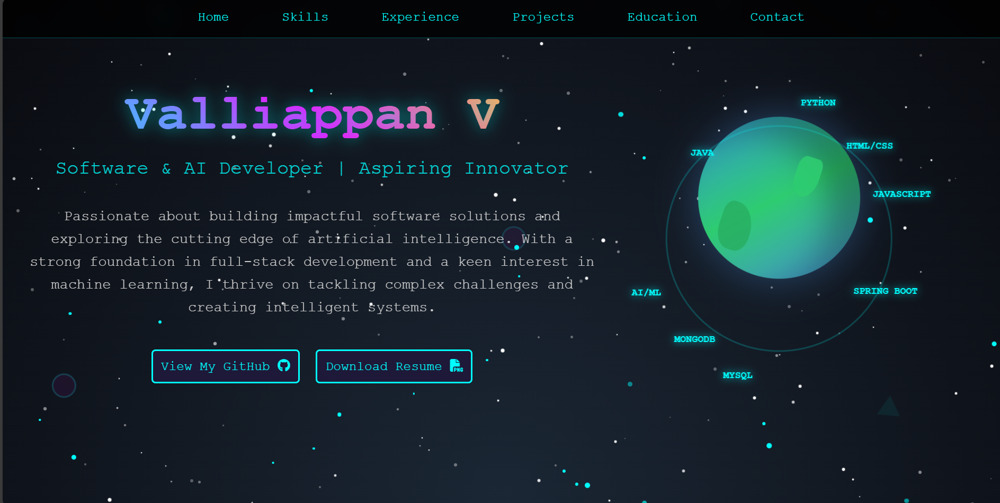

# 🌐 Portfolio Website

Welcome to my personal portfolio website! This is a responsive, modern, and minimal portfolio designed to showcase my work, skills, and background. Built using html,css , js, it's deployed and live at: [https://valliappan337.github.io/My-personal-portfolio-website/]

## 📸 Preview

 <!-- Replace with your actual screenshot file -->

## 🚀 Features

- Fully responsive design
- About section
- Project showcase with images/links
- Resume/CV download
- Contact form (email/third-party integration)
- Smooth scrolling and animations

## 🛠️ Built With

- HTML5, CSS3, JavaScript
- [React ] 

- [EmailJS ] 
- Deployed with [GitHub Pages ]

## 📂 Project Structure

